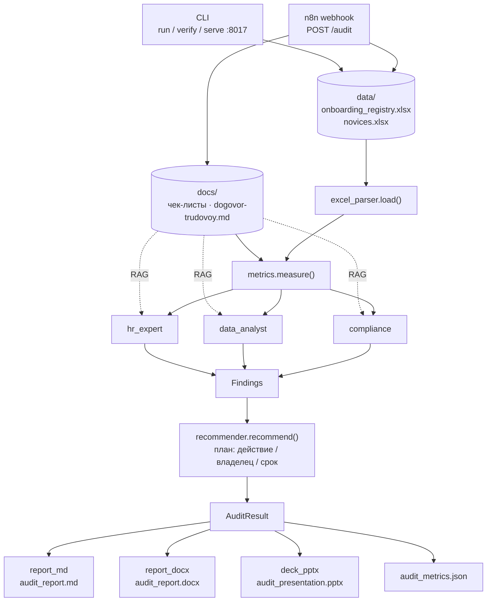

# ai-onboarding-audit

Мультиагентный аудит процесса онбординга сотрудников: три ИИ-агента проверяют
процесс по реестру, фактам и нормативным документам, рекомендатор собирает план
действий, а отчёты для руководства формируются в Markdown, Word и PowerPoint.

## Возможности

- **Три агента анализа** (`hr_expert`, `data_analyst`, `compliance`) — процесс
  и план развития, фактические сроки/пересроки/отсев, соответствие
  ГОСТ Р ИСО 9001. Промпты ролей — открытые `md`-файлы в `src/audit/prompts`.
- **Прослеживаемость**: у каждой находки есть агент, этап, severity и деталь.
- **Рекомендатор** кластеризует находки по смыслу (одна проблема = одно
  действие) и выдаёт план: действие / владелец / срок.
- **RAG-контекст**: требования чек-листов и регламенты подтягиваются в агентов.
- **Три формата отчётов**: Markdown (источник истины), DOCX, PPTX.
- **Метрики**: сроки, переносы, отсев, скорость и покрытие этапов
  (`audit_metrics.json`).
- **Интеграция с n8n** через HTTP-webhook.

## Быстрый старт

```bash
git clone https://github.com/diana-AI-coder/ai-onboarding-audit.git
cd ai-onboarding-audit
pip install -e .          # или: pip install -r requirements.txt
python -m src.cli run      # сгенерирует отчёты в examples/sample_report
```

Демо-данные (`data/*.xlsx`) и документы (`docs/*.md`) лежат в репозитории —
прогон не требует внешних источников.

## CLI

```bash
python -m src.cli verify   # проверка источников и покрытия этапов
python -m src.cli run --formats md,docx,pptx
python -m src.cli serve --port 8017   # webhook-сервер для n8n
```

Полный формат также доступен как консольная команда `onboarding-audit`
после `pip install -e .`.

## n8n / webhook

Документация: [`docs/n8n_trigger.md`](docs/n8n_trigger.md).
Workflow: [`n8n/onboarding_audit_trigger.json`](n8n/onboarding_audit_trigger.json).

```bash
curl -X POST http://127.0.0.1:8017/audit \
  -H "Content-Type: application/json" \
  -d @n8n/onboarding_scenario.json
```

- Тело: `dataDir`, `docsDir`, `outDir` (относительно корня запущенного сервиса),
  `formats`, `candidate`.
- Ответ: `{ok, triggered_by, n_novices, critical, warnings, coverage, artifacts}`.
- Коды ошибок: `412` — проблемы источников, `400` — неверные параметры,
  `500` — ошибка исполнения.

## Архитектура

Векторная диаграмма: [`docs/architecture.svg`](docs/architecture.svg).



## Структура проекта

```
data/                демо-данные: реестр новичков и фактические этапы
docs/                чек-листы этапов, регламенты, документация
src/
  ingest/            загрузка Excel-источников
  audit/             метрики, модель, оркестратор, агенты, промпты
  output/            markdown/docx/pptx, метрики
src/cli.py           CLI + webhook-сервер
n8n/                 workflow для n8n и сценарий-пример
examples/sample_report/  сгенерированные отчёты
scripts/             генераторы демо-данных и диаграммы
tests/               20 тестов: парсер, оркестрация, отчёты
```

## Тесты

```bash
python -m pytest tests -q
```

## Стек

Python 3.10+ · pandas · openpyxl · requests · pytest · officecli (DOCX/PPTX)
· n8n (RPA) · ГОСТ Р ИСО 9001